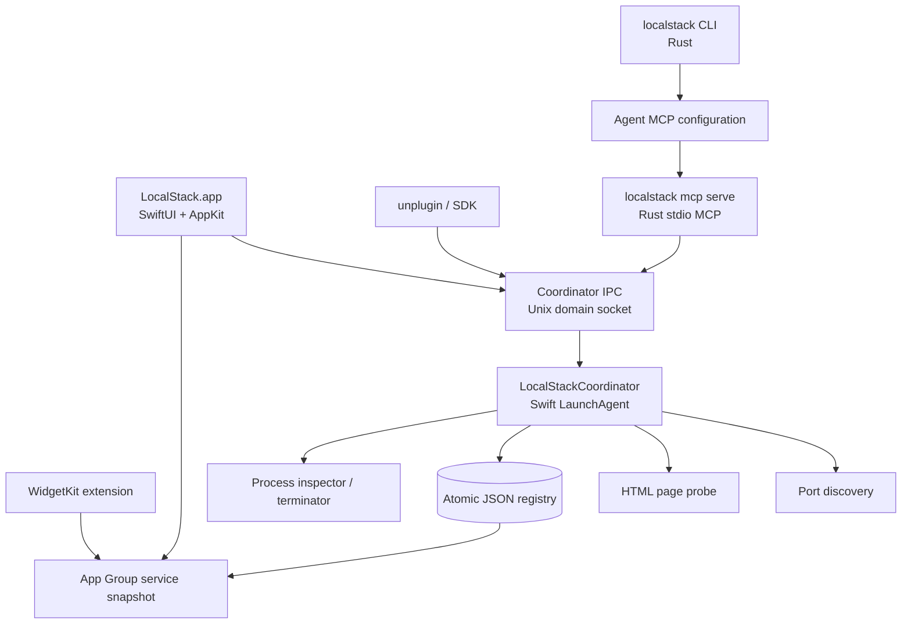

# 模块架构与本地协议

## 1. 总体拓扑



Coordinator 支持独立、常驻的当前用户 LaunchAgent，也支持菜单栏 App 内嵌运行，便于无安装器开发和单文件试用。两种模式只能启用一个实例：App 内嵌模式由 App 持有 Coordinator 并服务 UI/Widget；如果 socket 已由 LaunchAgent 持有，App 会切换到只读/控制客户端模式，而不是创建第二份状态。无 UI 的自动化机器使用 LaunchAgent 模式。

建议用 `SMAppService` 安装和管理随 App 签名的 helper/agent。Coordinator 的 Unix domain socket 位于用户 Application Support 私有目录，目录权限 `0700`、socket 权限 `0600`。不通过网络端口暴露控制接口。

## 2. Swift 模块边界

| 模块 | 责任 | 不负责 |
| --- | --- | --- |
| `LocalStackApp` | App 生命周期、菜单栏入口、设置、深链分发 | 端口扫描、进程终止决策 |
| `TrayPanelFeature` | 托盘弹出面板、筛选、打开、确认停止 | 直接发送 POSIX signal |
| `ServiceListFeature` | 服务行、空态、加载与错误态、可访问性标签 | 维护独立服务缓存 |
| `WidgetExtension` | 读取 App Group 快照，发起打开 Intent | 直接读取 Registry 或结束进程 |
| `Coordinator` | 排程、注册表、合并、健康检查、IPC 路由 | UI 状态与布局 |
| `PortDiscovery` | 枚举当前用户监听中的 TCP socket，生成候选端点 | 判断页面是不是 HTML |
| `PageProbe` | URL 验证、标题、favicon、重定向与缓存 | 决定终止或显示策略 |
| `ProcessInspector` | 读取 UID、启动时间、可执行路径、socket 归属，生成 fingerprint | 以端口号猜测服务名称 |
| `ProcessTerminator` | 在再次验证后发 `SIGTERM`、等待并回报结果 | 任意 `SIGKILL` 或杀父 shell/进程组 |
| `RegistryStore` | 原子 JSON 持久化、审计记录、只读快照导出 | 探测和网络请求 |
| `CoordinatorClient` | App、SDK 侧的强类型 IPC 客户端 | 绕开 Coordinator 修改数据库 |

共享类型放在 `LocalStackShared`：`ServiceID`、`ServiceEndpoint`、`ServiceMetadata`、`ProcessFingerprint`、`ServiceSource`、`ServiceHealth`、请求/响应 DTO 和错误码。该模块不能依赖 SwiftUI、AppKit 或具体存储实现。

## 3. 服务数据模型

```text
ServiceRecord
  id: UUID
  endpointKey: EndpointKey                 // canonical loopback + port
  preferredURL: URL                        // 已验证、打开时使用的 URL
  process: ProcessFingerprint
  display: DisplayMetadata                 // 标题、favicon 缓存键、来源说明
  validation: ValidationEvidence
  health: ServiceHealth
  sources: [SourceAttachment]
  firstSeenAt / lastSeenAt / lastHealthyAt

ProcessFingerprint
  pid: Int32
  uid: uid_t
  startTime: Date                          // 必填，禁止仅靠 PID
  executablePath: String?                  // 仅本地保存，用于诊断

ValidationEvidence
  checkedURL: URL
  finalURL: URL
  statusCode: Int
  contentType: String?
  title: String?
  faviconURL: URL?
  checkedAt: Date

SourceAttachment
  kind: .discovered | .sdk | .unplugin | .mcp
  registrationID: UUID?
  leaseExpiry: Date?
  metadata: RegistrationMetadata?
  lastSeenAt: Date
```

`endpointKey` 使用规范化后的 loopback 主机族和端口，不因 `localhost` 与 `127.0.0.1` 产生重复行。若同一端口可从多个 loopback 地址访问，它们是同一个 Service 的多个 `reachableURLs`，按最近一次成功验证的 URL 选 `preferredURL`。

合并原则：同一进程 fingerprint 且同一 `endpointKey` 的来源合并为一条 Service。有效主动注册的名称、项目路径和图标优先于自动探测到的页面标题；页面标题与 favicon 仍由本地验证结果提供。不同 PID 即便恰好复用了端口，也必须先使旧记录失效再建立新记录，绝不能继承旧记录。

## 4. Coordinator 的职责与持久化

首发实现使用用户 Application Support 下权限为 `0600` 的原子 JSON 文件保存服务快照、注册来源、PID fingerprint 和验证证据；文件格式保留版本字段，后续高规模版本可无缝迁移到 SQLite。图片数据不写入注册表；favicon 以内容 hash 缓存在 Application Support 的私有目录，并有大小和过期时间上限。

注册表恢复时不能盲信持久化内容：每条记录均先重读 PID fingerprint、确认 socket 归属，再做一次页面探活；失败即删除或标记为失活。这样 App/Coordinator 重启不会让旧服务“复活”。

Coordinator 将经过脱敏的只读 `ServiceWidgetSnapshot` 原子写入 App Group。Snapshot 不含 PID、可执行路径、lease、审计信息和注册密钥；Widget 只显示名称、URL、健康状态、图标键和深链 ID。

## 5. IPC 设计

Coordinator socket 使用 Unix domain socket 上的换行分隔 JSON-RPC 2.0。每个请求包含请求 ID、方法和参数；每个响应使用稳定错误码，以方便 Swift、Rust 和 TypeScript 三端映射。服务端限制单条请求 1 MiB，客户端限制响应 8 MiB，并校验 peer UID 必须是当前用户。

| 方法 | 调用者 | 关键输入 | 返回 |
| --- | --- | --- | --- |
| `service.register` | SDK、unplugin、MCP | `pid`、`port`、可选 URL/元数据 | `service`、`registrationID`、`leaseToken` |
| `service.heartbeat` | 主动注册者 | `registrationID`、`leaseToken` | 更新后有效期 |
| `service.unregister` | 主动注册者 | `registrationID`、`leaseToken` | 是否移除来源/服务 |
| `service.list` | App、MCP | 可选健康状态/来源过滤 | 服务快照 |
| `service.openTarget` | App、Widget Intent | `serviceID` | 再验证后的 URL 或错误 |
| `service.prepareTermination` | App | `serviceID` | 固定目标摘要和可终止性 |
| `service.terminate` | App、MCP | `serviceID`、预检 token、可选 force | 终止结果 |
| `system.status` | App、CLI | 无 | Coordinator、扫描、IPC 诊断信息 |

Unix socket 创建在当前用户私有目录，目录权限为 `0700`、socket 权限为 `0600`，从文件系统层限制连接者。注册成功时，Coordinator 生成不可预测的 lease token，并仅在内存中持有；后续 heartbeat、更新和注销需要同时携带 registration ID 与 token。协议在首次稳定版本定为 `v1`，未知字段忽略、未知主版本拒绝。

`service.prepareTermination` 返回短时有效的一次性 token，UI 将目标名称、PID、端口和执行路径摘要展示给用户后才可调用 `service.terminate`。这避免用户在确认期间面对已经被新进程复用的 PID。

## 6. SwiftUI、菜单栏与 Widget

### 主入口

应用是菜单栏优先的 `LSUIElement`。点击图标打开紧凑、可键盘操作的托盘面板：服务内容是可扫描的列表，顶部工具栏是控制层。常用行为是单击服务行或 Enter 打开页面，行尾的 `ellipsis` 菜单放置复制 URL、显示详情和停止操作。面板底部状态栏的设置菜单提供“开机启动”开关，通过 SMAppService 注册登录项实现；状态为 `.requiresApproval` 时引导用户到系统设置批准。

不要把每一行包成厚重玻璃卡片。列表行属于内容层：图标、名称、`localhost:port`、健康时间和来源标签清晰对齐即可。工具栏、筛选器和悬浮操作遵循系统 Liquid Glass；颜色仅用于健康状态及主要动作。视觉基调是冷静、技术化的本地工作台：中性色内容层，唯一强调色用于“打开”，红色只用于停止确认。

### 关键交互

| 场景 | 设计 |
| --- | --- |
| 正常列表 | 最重要的服务信息在 leading，打开为主行为，次要操作收在行尾菜单。 |
| 无服务 | 明确说明当前没有“可打开的本地页面”，而不是暗示端口扫描失败；提供刷新图标按钮。 |
| 探测中 | 保留上次可用内容，工具栏显示低干扰进度，不让整个列表跳动。 |
| 服务失活 | 行以平滑缩退动画移除；若用户正打开它，显示“服务已停止”的可恢复提示。 |
| 停止服务 | 原生 confirmation dialog/alert 显示名称、URL、PID；默认按钮为取消，红色“停止服务”独立放置。 |
| 详情 | 二级 sheet 或独立 inspector，展示来源、最后探活、项目路径（用户允许时）和诊断错误。 |

桌面 Widget 使用 Small/Medium 两种尺寸，展示前 1/3 个健康服务和刷新时间。点击行深链至打开服务；“停止”不在 Widget 直接执行，而是深链到 App 的确认对话框。Widget 通过 App Intent 请求打开既定服务，Coordinator 再验证 URL 后由 App 打开默认浏览器。

### Liquid Glass 与无障碍

- 玻璃只用于菜单栏面板的工具栏、筛选与控制，不用于服务内容卡片。
- 依赖语义化动态颜色与系统材质；测试浅色、深色、降低透明度、提高对比度和减少动态效果。
- 每个图标操作有标签和 tooltip；服务行提供 VoiceOver 的完整组合描述，包含名称、URL、状态与来源。
- 支持键盘：上下导航、Enter 打开、Command-R 刷新、Delete 仅打开停止确认，不能直接终止。
- 图标不单独承载健康语义；状态有文字化 accessibility value。

## 7. SDK 与 unplugin

首期交付 TypeScript `unplugin-localstack`，先覆盖 Vite，并为 webpack、Rspack、Rollup、esbuild 提供适配器。它在 dev server 的 `listening` 生命周期取得实际端口后调用本机 Coordinator：

```ts
LocalStackPlugin({
  name: "Acme Console",             // 可选，优先于 HTML title
  projectRoot: process.cwd(),
  url: "http://127.0.0.1:5173",     // 可选，Coordinator 会再次验证
})
```

插件不自行决定服务有效性，也不把“启动成功”当成注册成功。它提交当前服务进程 PID、监听端口及可选元数据，得到 lease 后以固定节奏 heartbeat，在 dev server close/exit 钩子注销。Coordinator 不可用时只记录一次可读 warning，不得阻断开发服务器启动。

SDK 协议与 unplugin 共用 `CoordinatorClient`/JSON schema。后续多语言 SDK 只能是该协议的薄客户端，禁止产生第二套注册表或探活逻辑。

## 8. Rust CLI 与本地 MCP 服务

`localstack` 是一个 Rust 二进制，负责安装 MCP、提供诊断，并运行 stdio MCP server；它不直接修改 Coordinator 数据库。建议依赖 `clap`、`tokio`、`serde`、`serde_json`、`thiserror`，以及一个经过维护的 MCP Rust SDK 或对 MCP JSON-RPC 的小型适配层。

| 命令 | 行为 |
| --- | --- |
| `localstack mcp serve` | 在 stdio 上运行 MCP，转发请求给 Coordinator socket。 |
| `localstack mcp install --target <name>` | 以幂等方式写入指定 agent 的 MCP 配置，命令为绝对路径的 `localstack mcp serve`。 |
| `localstack mcp uninstall --target <name>` | 只删除带 LocalStack 标识的条目。 |
| `localstack mcp doctor` | 检查 App/Coordinator、socket 权限、版本兼容和 agent 配置。 |
| `localstack status` | 输出无密钥的机器可读诊断和服务摘要。 |

安装器通过 adapter 层支持 Codex、Claude Code、Cursor 等目标，而不是假设所有产品使用同一配置文件。写入前解析 JSON/JSONC/TOML，生成同目录带时间戳备份，保留未知字段；配置损坏时拒绝覆盖并输出修复说明。`--target auto` 只列出和安装到当前机器上可确认存在的配置，不猜测不存在的产品。

MCP 暴露三个工具：

| MCP tool | 输入 | Coordinator 行为 |
| --- | --- | --- |
| `localstack_register_service` | `pid`、`port`、可选名称、URL、项目路径 | 同 `service.register`；返回验证失败原因，绝不返回伪成功。 |
| `localstack_list_services` | 可选来源/健康过滤 | 同 `service.list`，默认只含可打开服务。 |
| `localstack_terminate_service` | 精确 `serviceId`，可选 `force` | 重新预检 PID/端口；默认仅 `SIGTERM`。 |

MCP 的终止调用本身必须来自 agent 已获得的明确用户意图；服务端仍要求精确 ID，默认不强制杀进程。若需要 `force`，工具参数应显式为 `true`，响应中记录进程验证与实际信号。MCP 不接收 shell 命令、任意路径或任意 signal。

## 9. 可观察性、隐私与错误边界

仅本地保留有限环形审计：注册验证结果、探活失败类别、注销原因、终止预检/信号结果和协议版本。不记录 HTML 正文、不记录完整命令参数、不记录 MCP 对话。设置中可一键清除缓存与审计，不影响当前运行服务的下一次发现。

每个错误都应可操作：例如“端口仍在监听，但返回 `application/json`，未列入服务”或“PID 已在注册后复用，已取消终止”。UI 不暴露内部 token、完整私密路径和原始网络错误；详情页可在用户主动展开后提供足够的本地诊断。
