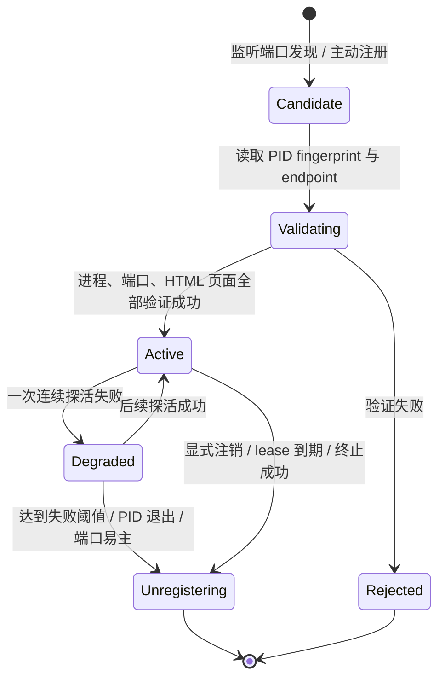
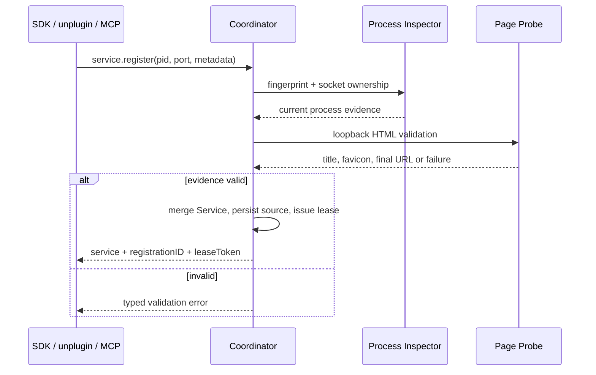

# 服务生命周期、安全策略与验证规则

## 1. 生命周期状态机

`Candidate` 和 `Rejected` 不写入可见列表。`Degraded` 仅短暂保留，以免开发服务器热重启时列表闪烁；一旦判定已失活，Coordinator 直接注销，用户界面不保留“已停止”的陈旧条目。

## 2. 自动发现

### 2.1 候选端口的来源

首选通过 macOS 的进程/socket 信息接口枚举**当前用户**的 TCP `LISTEN` socket，得到：PID、端口、监听地址和协议。实现时将系统查询封装在 `PortDiscovery` 中，可使用稳定的 `libproc`/系统 API；开发与兼容环境可用受控的 `lsof -nP -iTCP -sTCP:LISTEN` 适配器作为诊断/回退，不能把 CLI 输出格式扩散进业务逻辑。

只接受以下候选：

- 进程 UID 等于当前登录用户；
- TCP 监听地址为 `127.0.0.1`、`::1`，或 wildcard 地址但可从 loopback 建连；
- PID 可读取、能取得启动时间；
- 仅跳过已证实为 Miniflare 内部的 `workerd` entry/debug/inspector 端点：核对完整启动参数、实际监听表与 `pid + uid + startTime`，每轮扫描及请求前重新核对，不持久化排除。进程重启、PID 复用或端口易主后立即重新判断；元数据不足、独立 `workerd` 网站和其他公开端点仍正常探测，显式注册不受此规则影响；
- 未被用户设置为忽略的端口或服务 fingerprint。

不做 `1...65535` 范围扫描。它既扰民、消耗高，也不能可靠关联 PID；应从操作系统实际监听表生成有限候选集合。

### 2.2 排程

| 工作 | 正常周期 | 触发条件 | 目的 |
| --- | --- | --- | --- |
| socket diff | 10 秒 | App/Coordinator 启动、菜单栏手动刷新、注册后 | 快速发现新增/消失端口 |
| 页面验证 | 发现即执行，带并发上限 4 | 新候选、端口/PID 变化 | 判断是否可浏览 |
| PID/socket 轻检查 | 5 秒 | 所有 Active/Degraded 服务 | 尽快移除退出或端口易主服务 |
| HTTP 健康检查 | 15 秒 | Active 服务 | 判断页面是否仍可达 |
| favicon 更新 | 24 小时 | 标题/图标缺失或缓存失效 | 避免频繁拉取静态资源 |

Coordinator 在电池、网络受限或空闲时可以降低扫描频率，但手动刷新永远立即执行。页面验证使用每服务退避，反复失败的同一 fingerprint 在 60 秒内不重复请求；新的 PID fingerprint 不受该退避影响。

## 3. “可访问页面”的严格判定

自动发现只尝试 `http://127.0.0.1:<port>/` 或等价 loopback URL；不访问监听进程公布的局域网地址，也不根据端口号向外部服务请求。主动注册可以提交 URL，但主机必须规范化为 loopback 且端口与注册端口一致。

一次成功验证必须同时满足：

1. 注册 PID 的 fingerprint 当前有效，UID 是当前用户；
2. 该 PID 或其受控子进程拥有候选监听 socket，端口没有在验证期间易主；
3. 最终响应为 `2xx`；
4. 最终 URL 仍是 loopback，重定向最多 3 次，禁止跳转到 LAN、互联网或自定义协议；
5. `Content-Type` 为 `text/html`/`application/xhtml+xml`，或缺失时前 4 KiB 可以明确识别为 HTML；
6. 响应大小在 512 KiB 限制内，超限即中止；
7. 请求超时、TLS 错误、认证失败和 HTML 以外的响应都不通过。

用 `GET` 而不是仅 `HEAD`，设置 `Accept: text/html,application/xhtml+xml`，禁用 cookie 持久化和凭据。读到 `<title>` 后继续至足够确认 HTML 为止，不保存正文。先解析 `<link rel="icon">`，缺失时再尝试同源 `/favicon.ico`；favicon 获取失败不影响服务有效性。页面没有标题时，使用 `host:port` 作为临时显示名。

以下常见端口必须拒绝，不应以“HTTP 成功”误列：

| 响应 | 原因 |
| --- | --- |
| `application/json`、`application/problem+json` | 纯 API，不提供可浏览页面。 |
| gRPC、WebSocket 升级、SSE-only | 不存在可打开的页面。 |
| `401`/`403`/`404` | 不属于当前可访问页面。 |
| HTML 重定向到外部身份提供商 | LocalStack 不能把外部站点作为本地服务展示。 |
| TLS 无法由系统信任 | 默认浏览器无法直接可靠打开；首期拒绝而非放宽证书校验。 |

重定向必须保持同一个 loopback 主机、HTTP scheme 和端口；不能借由本机页面跳转到另一个本地端口。

## 4. 主动注册与 lease

### 4.1 注册流程

必填字段是 `pid`、`port`。`displayName`、`projectRoot`、`url`、`iconHint` 仅为候选元数据，不能覆盖 Coordinator 从 OS 和网络验证得到的事实。`projectRoot` 不出现在 Widget snapshot；它只在主 App 的详情页展示，且须用户允许显示。

注册成功后的 lease 默认 45 秒，客户端每 15 秒 heartbeat。客户端正常退出时主动注销；客户端崩溃时 lease 到期只移除该来源。若自动发现或另一主动来源仍有效，Service 保持可见。Coordinator 重启会按持久化的 PID fingerprint 重新验证，不因 lease 尚未到期而跳过验证。

### 4.2 来源合并与优先级

| 信息 | 优先级 |
| --- | --- |
| PID、端口、最终 URL、健康状态 | Coordinator 实测结果唯一可信 |
| 显示名称 | 有效主动注册 > HTML title > `localhost:port` |
| 项目路径 | 有效主动注册；仅详情显示 |
| 图标 | 已验证同源 favicon > 主动注册的本地安全图标 hint > 默认符号 |
| 可见性 | 任一已验证的 source 或自动发现仍活跃即保留 |

来源不会绕过“HTML 页面”规则。一个注册请求若 PID 存在但端口返回 JSON，应返回 `notBrowsablePage`，不会创建一个只靠 SDK 可见的服务。

## 5. 健康检查和自动注销

每次健康周期按以下顺序执行，任何强失败都无需等待三次 HTTP 失败：

1. 读取 PID；不存在、UID 不匹配或启动时间不同，立即注销。
2. 重新检查 port ownership；端口不再由已登记 PID/允许子进程拥有，立即注销。
3. 对 `preferredURL` 执行受限 HTML GET；成功则更新 `lastHealthyAt`、标题和图标缓存。
4. 临时网络/服务器失败标记为 `Degraded`；连续 3 次失败（约 45 秒）则注销。

在 `Degraded` 中，服务仍可见但明确标注“正在确认状态”，打开前会立即再验证。自动发现的候选只要仍在监听，就不会因一次扫描 probe 失败被移除，而是由健康检查累计三次失败。服务一旦被证明失活，从 JSON 注册表、内存快照和 Widget snapshot 中原子删除，并使其所有 `openTarget`/termination token 失效。

注销原因应分类记录：`processExited`、`pidReused`、`portOwnershipChanged`、`pageUnavailable`、`leaseExpired`、`clientUnregistered`、`terminated`、`validationRejected`。这既利于诊断，也避免把正常热重启误报成异常。

## 6. 打开服务

“打开”不是直接相信缓存 URL：Coordinator 接到 `service.openTarget` 时先执行 PID/socket 快速检查，必要时做一次短超时 HTML 验证，再返回 `preferredURL`。App 使用默认浏览器打开该 URL。验证失败则不打开，并刷新列表状态。

这条路径防止服务退出后，同一端口被另一程序接管，用户却因旧列表打开了错误服务。

## 7. 终止策略

### 7.1 UI 的二次确认

托盘服务行的默认操作始终是打开。停止位于 `ellipsis` 菜单或详情页的破坏性区域。触发后先向 Coordinator 请求 `prepareTermination`，再显示系统 confirmation dialog：

- 显示服务名、`localhost:port`、PID 和可执行文件名；
- 默认焦点为“取消”；
- 破坏性按钮为红色“停止服务”；
- 若预检失效，关闭确认框并刷新列表；
- Widget 的停止入口只能把用户带到这个确认流，不能后台静默结束进程。

### 7.2 服务端终止护栏

在真正发送 signal 的瞬间，Coordinator 必须在单一串行临界区再次确认：

1. `serviceID` 存在且未注销；
2. prepare token 未过期且属于同一 `ServiceID`；
3. 当前 PID、UID、启动时间完全匹配原始 fingerprint；
4. 端口仍归属于该 PID 或受控子进程；
5. 不属于 LocalStack 自身、Coordinator、Widget 或 CLI/MCP 进程。

通过后只发 `SIGTERM`，等待至多 4 秒并持续检查端口释放和 PID 退出。成功后立即注销记录。没有退出时，GUI 可以让用户另行选择“强制停止”；该选项再次显示确认、明确标注 `SIGKILL`，且只在重新验证仍通过时执行。不要默认发送 `SIGKILL`，不要 kill process group，不要向父 shell、祖先或不相关的同端口进程传播 signal。

MCP 的 `localstack_terminate_service` 调用使用同一预检与重验证链。它没有 GUI dialog，因为 agent 的该工具调用是用户明确的执行动作；但默认仍仅发 `SIGTERM`，强制停止需要显式 `force: true`。MCP 不允许按 port、名称或 PID 模糊匹配，只能使用 `serviceId`。

## 8. 并发与故障处理

- 以 `serviceID` 为粒度序列化状态转移；探活、注销和终止不能并发提交过期写入。
- 每个 probe 带 `fingerprint + generation`。响应返回时 generation 已变更则丢弃，防止旧 HTTP 回调恢复新服务的状态。
- JSON 注册表更新、内存服务图和 Widget snapshot 通过单一发布序列更新，订阅者不能看到半合并状态。
- socket/Coordinator 不可用时，SDK/unplugin 退化为无注册，不影响开发服务器；App 显示本地诊断，而不是尝试私自扫描或修改数据库。
- 无法读取他人用户进程时静默跳过；不请求提升权限。
